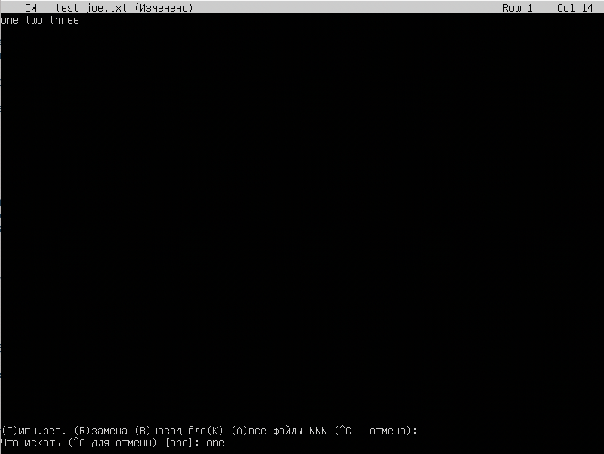
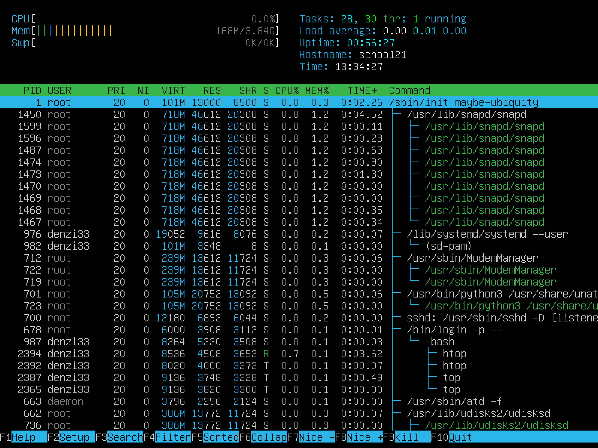

## Installation of the OS:

* Ubuntu 20.04 Server LTS without GUI was intalled in virtual machine VirtualBox;

* Check Ubuntu version by running the command "cat /etc/issue":

## Creating a user:

* User was created by running the command "sudo useradd denzi33":

* User was added to the adm group by running the command "sudo usermod -a -G adm denzi33";

* A list of users and folders show by running the command "sudo cat /etc/passwd":

## Setting up the OS network:

* At first install the necessary net-tools by running the command "sudo apt install net-tools";

* The machine name was set by running the command "hostnamectl set-hostname user-1";

* After restart system to update username by running the command "shutdown -r now";

* Timezone has been set by running the command "timedate set-timezone Europe/Moscow";

* Display a list of interfaces by running the command "ifcongfig -a":

  * lo (loopback device) is a virtual interface present by default in any Linux. It is used to debug network programs and run server applications on the local machine. The address 127.0.0.1 is always associated with this interface.;

* Getting the IP address from DHCP by running the command "ip a show":

  * DHCP (Dynamic Host Configuration Protocol) is a network management protocol used to automate the process of configuring devices on IP networks, thus allowing them to use network services such as DNS, NTP, and any communication protocol based on UDP or TCP.;

* Our IP from DHCP 10.0.2.15, mask 24;

* At first install a curl tools by running the command "sudo apt-get install curl";

* Display the external IP address of the gateway by running the command "curl ident.me":

* The external IP is 195.133.239.83;

* Display the internal IP address of the gateway by running the command "ip route | grep default":

* Opening a file "00-unstaller-config.yaml" with nano mode;

* Setting the static ip, gw, dns settings by redactoring file; 

* Display a settings by running the command "cat /etc/netplan/00-installer-config.yaml":

* After running the command "sudo netplan apply";

* Restart the system to update username by running the command "shutdown -r now";

* Display againg a settings by running the command "cat /etc/netplan/00-installer-config.yaml";

* Ping 1.1.1.1 and ya.ru by running the commands "ping -c 5 1.1.1.1" and "ping -c 5 ya.ru":

## OS Update:

* At first running the command "sudo apt-get update";

* Run the command "sudo apt-get dist-upgrade";

* Run again the last command:

## Using the sudo command:

* Give to user denzi33 sudo rules by running the command "sudo adduser denzi33 sudo";

  * Sudo is a program for Unix-like computer operating systems that enables users to run programs with the security privileges of another user, by default the superuser. The main purpose of sudo is to run a command as another user, usually root. The point of executing a command as root is that root has elevated permissions, and by using sudo, a normal user can perform actions for which he does not have sufficient rights. 

* Change user by running the command "sudo su denzi33";

* Change the OS hostname via the user created in part 2 by running the command "sudo hostnamectl set-hostname school21";

* Display the new hostname by running the command "hostname":

## Installing and configuring the time service:

* Set up the automatic time synchronisation service by running the command "sudo timedatectl set-ntp on";

* Output the time of the time zone in which I currently located by running the command "timedatectl show":

## Installing and using text editors:

* Install VIM, NANO, JOE text editors by running the commands "sudo apt install nano", "sudo apt install joe" and "sudo apt install vim";

* Create a file with NANO redactor by running the command "nano test_nano.txt";

* Write in file nickname:

  * To exit with the changes saved press combination "control" + "X" after press "Y" and "Enter";

* Create a file with VIM redactor by running the command "vim test_vim.txt";

* Write in file nickname:

  * To exit with the changes saved press "esc" after write ":wq" and press "Enter";

* Create a file with JOE redactor by running the command "joe test_joe.txt";

* Write in file nickname:

  * To exit with the changes saved press combination "control" + "K" after press "Q" and press "Y"; 

* Open a file with NANO redactor by running the command "nano test_nano.txt";

* Write in file "21 school 21":

  * To exit with the changes saved press combination "control" + "X" after press "N";

* Open a file with VIM redactor by running the command "vim test_vim.txt";

* Write in file "21 school 21":

  * To exit with the changes saved press "esc" after write ":q!" and press "Enter";

* Open a file with JOE redactor by running the command "joe test_joe.txt";

* Write in file "21 school 21":

  * To exit with the changes saved press combination "control" + "K" after press "Z"; 

* Open a file with NANO redactor by running the command "nano test_nano.txt";

* Write in file "one two three";

* Find in file "one":

* Replace "one" to "two":

* Open a file with VIM redactor by running the command "vim test_vim.txt";

* Write in file "one two three";

* Find in file "one":

* Replace "one" to "two":

* Open a file with JOE redactor by running the command "joe test_joe.txt";

* Write in file "one two three";

* Find in file "one":

* Replace "one" to "two":

## Installing and basic setup of SSHD service:

* Install the SSH service by running the command "sudo apt-get install ssh";

* Install the OpenSSH service by running the command "sudo apt install openssh-server";

* Add an auto-start of the service whenever the system boots by running the command "sudo systemctl enable sshd";

* Open file sshd_config by running the command "sudo nano /etc/ssh/sshd_config";

* Write in last line "Port 2022";

* Show the presence of the sshd process by running the command "ps -C sshd":

  * ps - report a snapshot of the current processes;
  * -C - select processes by command name;

* We need to install net-tools by running the command "sudo apt install net-tools";

* Using the command "netstat -tan":

    
* Explain the meaning of the -tan keys, the value of each output column, the value 0.0.0.0. in the report:
  * -t - show only TCP ports;
  * -a - show both listening and non-listening sockets;
  * -n - show numerical addresses instead of trying to detemine symbolic host, port or user names;
  * 0.0.0.0 - is a non-routable IPv4 address that can be used for various purposes, mainly as a default or placeholder address;
  * Proto - The protocol used by the socket;
  * Recv-Q - The count of bytes not copied ny the user program connected to this socket;
  * Send-Q - The count of bytes not acknowledged by the remote host;
  * Local Address - Address and port number of the local end of the socket;
  * State - The state of the socket;

## Installing and using the top, htop utilities:

* Install top, htop by running the commands "sudo apt-get install htop" and "sudo apt install top";

* After run top by running the command "top";

* The results:
  * Uptime: 19 min;
  * Number of authorised users: 1;
  * Total system load: 0,00 0,00 0,02 for the last 1, 5 and 15 minutes;
  * Total number of processes: 95;
  * Cpu load: 0,0 us;
  * Memory load: 164,1 MiB;
  * Pid of the process with the highest memory usage: 1450;
  * Pid of the process taking the most : CPU time: 2387;

* Htop sorted by:
  *  PID:
  

  * PERCENT_CPU:
  

  * PERCENT_MEM:
  

  * TIME:
  

  * Filtered sshd process:
   

  * With the syslog process found by searching:
  

 * Press combination "Shift" + "s" to redact htop bar after add clock and hostname by the end press "esc";

  * Display with hostname, clock and uptime output added:
  

## Using the fdisk utility:

* Run the command "fdisk -l";

* A list of options of hard disk:
  * Name of hard disk is "VBOX HARDDISK";
  * The size of hard disk is "10 GiB";
  * Number of sectors is "20971520";
  * The swap size is "1 GiB";
    * We can check swap size by running the command "swapon -s";

## Using the df utility:

* Run the command "df";

* About the root partition (/):
  * Partition size: 8408452;
  * Space used: 2705116;
  * Space free: 5254620;
  * Percentage used: 34 %;
    * All options measured in Kbytes;

  * Run the command "df -Th";

* About the root partition (/):
  * Partition size: "8,1 G";
  * Space used: "2,6 G";
  * Space free: "5,1 G";
  * Percentage used: 34 %;
  
* The file system type for the partition "ext4 (fourth extended file system)";

## Using the du utility:

* Run the command "du":

* Size of "/home" is 88 Kbytes:

* Size of "/var" is 711 Mbytes:

* Size of "/var/log" is 19 Mbytes:

* Size of all contents in "/var/log*":

## Installing and using the ncdu utility:

* Install ncdu by running the command "sudo apt-get install ncdu":

* Run the command "ncdu":

* And go to directory var:

## Working with system logs:

* Login time: "Mar 24 15:26:21";
* Username: "school21";
* Login method "pam_unix - module for traditional password authentication";

* Restart sshd system by running the command "shutdown -r now";

* Check log files by running the command "cat /var/log/auth.log":

## Using the CRON job scheduler:

* Redact cron list by running the command "sudo crontab -e";

*  Execution of CRON jobs:

* List of current jobs for CRON was displayed by running the command "sudo crontab -l":

* List of current jobs for CRON after removing all tasksk from the job scheduler was displayed by running the command "sudo crontab -l":

