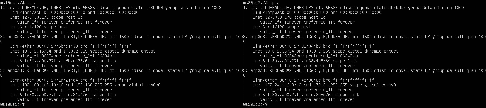
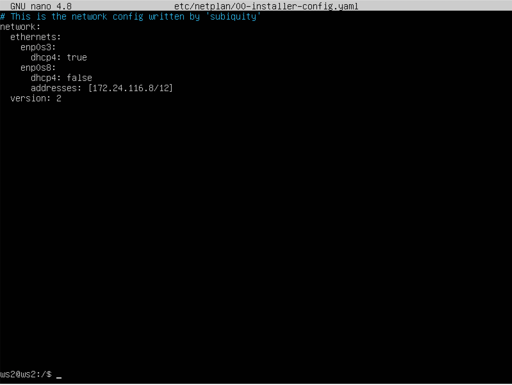
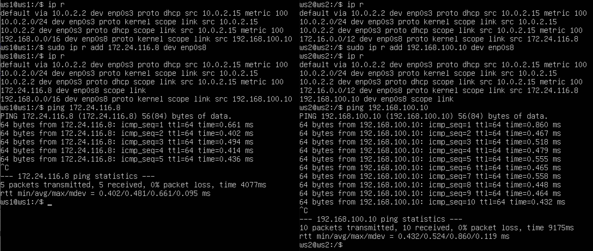
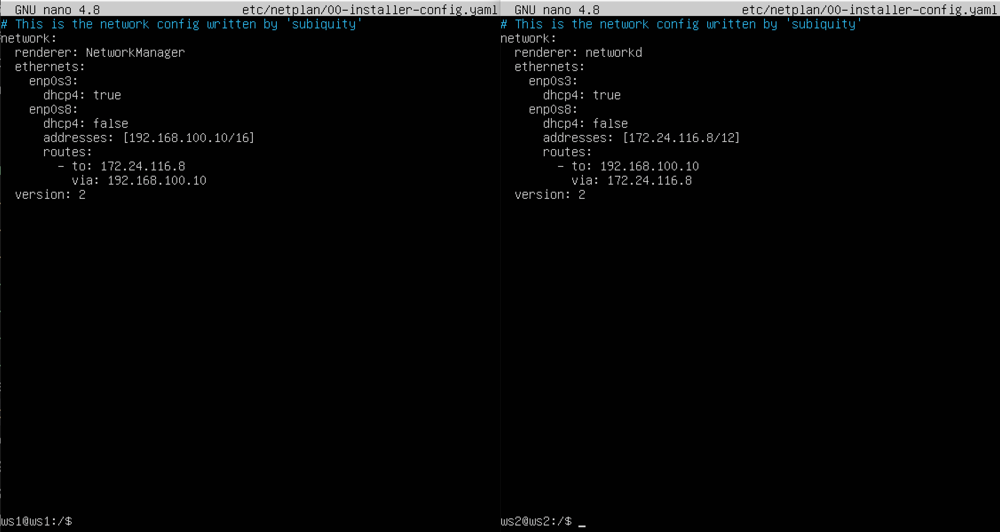
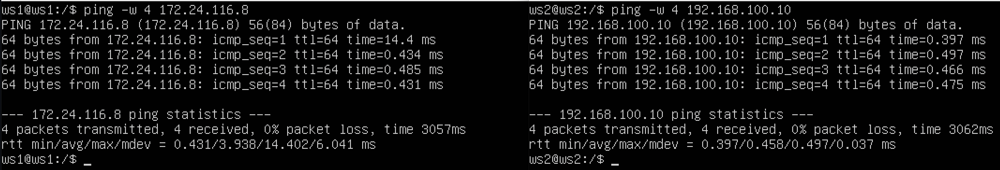
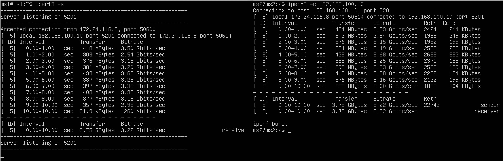
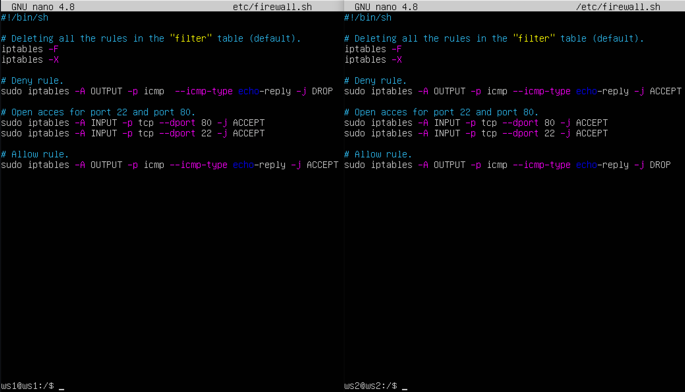
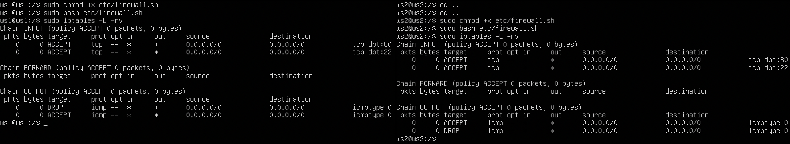

# Linux Network.

## Part 1. ipcalc tool

### 1.1. Networks and Masks:

1) Network address of `192.167.38.54/13`: `192.160.00.00`;

2.1) Conversion of the mask `255.255.255.0` to: 
    - Preifx: `/24`;
    - Binary: `11111111.11111111.11111111.00000000`; 

2.2) Conversion of the mask `255.255.255.0/15` to:
    - Normal: `255.254.0.0`;
    - Binary: `11111111.11111110.00000000.00000000`;

2.3) Conversion of the mask `11111111.11111111.11111111.11110000` to:
    - Normal: `255.255.255.240`;
    - Prefix: `/28`;

1.3) Minimum and maximum host in `12.167.38.4` network with masks: 
    - `/8`: minimum - `12.0.0.1` and maximum - `12.255.255.254`;
    - `11111111.11111111.00000000.00000000`: minimum - `12.167.0.1` and maximum - `12.167.255.254`;
    - `255.255.254.0`: minimum - `12.167.38.1` and maximum - `12.167.39.254`;
    - `/4`: minimum - `0.0.0.1` and maximum - `15.255.255.254`.

### 1.2. localhost:
Can be running on localhost with the following IPs:
- IP `194.34.23.100`: False;
- IP `127.0.0.2`: True;
- IP `127.1.0.1`: True;
- IP `128.0.0.1`: False.

### 1.3. Network ranges and segments:

1) List of IPs which can be used as:
- Public: `134.43.0.2`, `172.0.2.1`, `192.172.0.1`, `172.68.0.2`, `192.169.168.1`;
- Private: `10.0.0.45`, `192.168.4.2`,  `172.20.250.4`,`172.16.255.255`, `10.10.10.10`.

2)List of gateway IP addresses are possible for `10.10.0.0/18` network:
- Can: `10.10.0.2`, `10.10.10.10`;
- Can not: `10.0.0.1`, `10.10.100.1`, `10.10.1.255`.

## Part 2. Static routing between two machines

### 1.1. Networks and Masks:

- View existing network interfaces by using command `ip a`:

- Describe the network interface corresponding to the internal network on both machines:

- Set the following addresses and masks: 
    - ws1 - `192.168.100.10/16`:
    
    - ws2 - `172.24.116.8/12`:
    

- Run the `netplan apply` command to restart the network service:
    

### 2.1. Adding a static route manually:

- Add a static route from one machine to another and back using a `ip r add` command.

- Ping the connection between the machines:
    

### 2.2. Adding a static route with saving:

- Add static route from one machine to another using `etc/netplan/00-installer-config.yaml` file:
    

- Ping the connection between the machines:
    

## Part 3. iperf3 utility

### 3.1. Connection speed:

Convert:
- `8 Mbps` to `MB/s`: 1;
- `100 MB/s` to `Kbps`: 800000;
- `1 Gbps` to `Mbps`: 1000.

### 3.2. iperf3 utility:

- Connection speed between ws1 and ws2:
    

## Part 4. Network firewall

### 4.1. iptables utility:

- Create a /etc/firewall.sh file simulating the firewall on ws1 and ws2.

- The following rules should be added to the file in a row:
    - On ws1 apply a strategy where a deny rule is written at the beginning and an allow rule is written at the end (this applies to points 4 and 5);
    - On ws2 apply a strategy where an allow rule is written at the beginning and a deny rule is written at the end (this applies to points 4 and 5);
    - Open access on machines for port 22 (ssh) and port 80 (http);
    - Reject echo reply (machine must not ping, i.e. there must be a lock on OUTPUT).
    - Allow echo reply (machine must be pinged):
    

- Run the files on both machines with `chmod +x etc/firewall.sh` and `etc/firewall.sh` commands:
    

- The difference is that if the prohibition rule is the first one, then this corrupt rule will not work