# Simple Docker

## Part 1. Ready-made docker

* Let's take the official docker image `nginx`:
  * `docker pull`:
  Download an image from a registry.
  Usage: `docker pull [OPTIONS] NAME[:TAG|@DIGEST]`.

  * The pulling `nginx` docker image:
  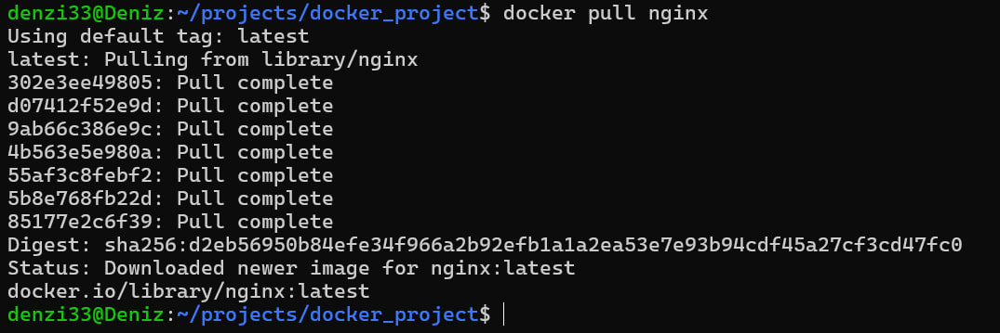

* Let's check the docker images:
  * `docker images`:
  List images.
  Usage: `docker images [OPTIONS] [REPOSITORY[:TAG]]`.

  * The docker images:
  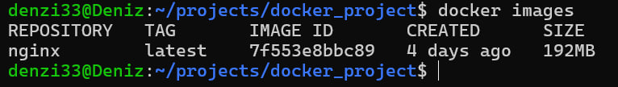

* Let's run docker image:
  * `docker run`:
  Create and run a new container from an image.
  Usage: `docker run [OPTIONS] IMAGE [COMMAND] [ARG...]`.
  Options: `-d` run container in background and print container ID.

  * The running docker image:
  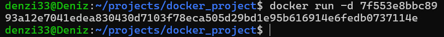

* Let's check that the image is running:
  * `docker ps`:
  The command shows list containers.
  Usage: `docker ps [OPTIONS]`.

  * The result of checking:
  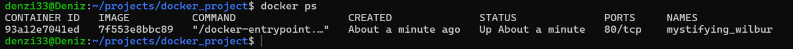

* Let's view the container information:
  * `docker inspect`:
  Return low-level information on Docker objects.
  Usage: `docker inspect [OPTIONS] NAME|ID [NAME|ID...]`.

  * The viewing container information:
  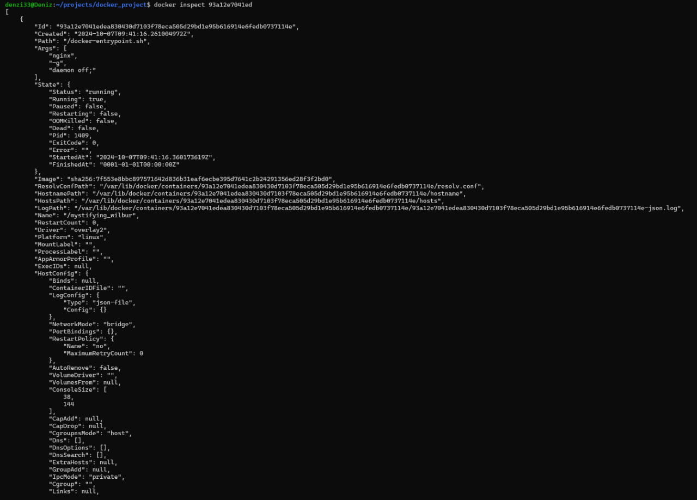
  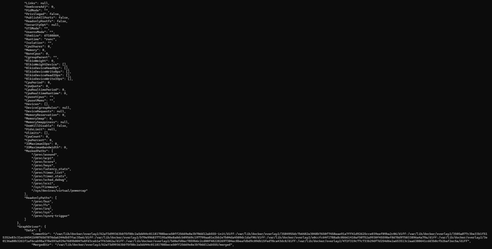
  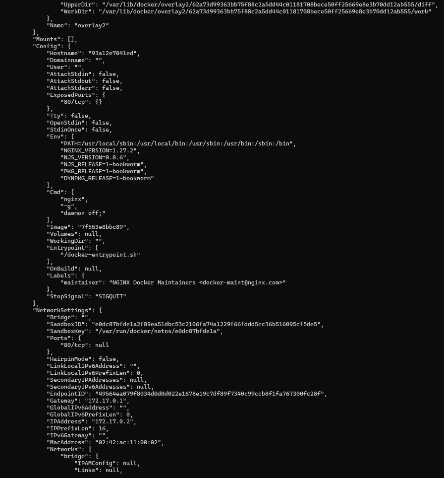
  

  * As we can see:
    * Container size is:
    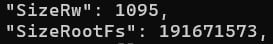

    * List of mapped ports are:
    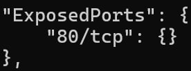

    * Container IP is:
    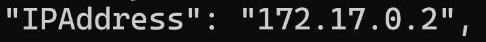

* Let's stop the docker image:
  * `docker stop`:
  Stop one or more running containers.
  Usage: `docker stop [OPTIONS] CONTAINER [CONTAINER...]`.

  * The stopping docker image:
  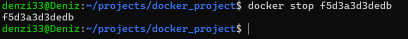

* Let's check that the image has stopped:
  * The image has stopped:
  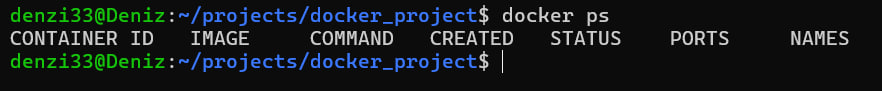

* Let's run docker with ports `80` and `443` in container, mapped to the same ports on the local machine:
  * Options: `-p` publish a container's port(s) to the host.

  * The running docker:
  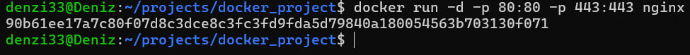

* Let's check that the `nginx` start page is available:
  * The `nginx` start page:
  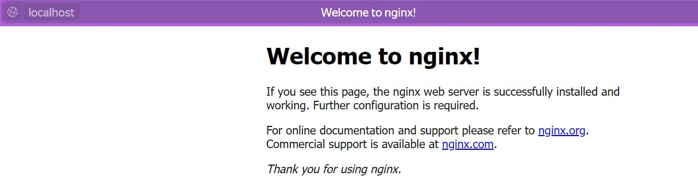

* Let's restart the docker container:
  * `docker restart`:
    Restart one or more containers.
    Usage: `docker restart [OPTIONS] CONTAINER [CONTAINER...]`.

  * The restarting container:
  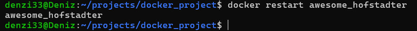

* Let's check the container:
  * The container:
  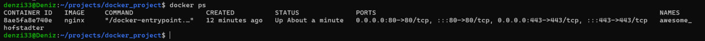

## Part 2. Operations with container

* Let's read the `nginx.conf` file inside the docker container:
  * `docker exec`:
  Execute a command in a running container.
  Usage: `docker container exec [OPTIONS] CONTAINER COMMAND [ARG...]`.

  * The `nginx.conf` file:
  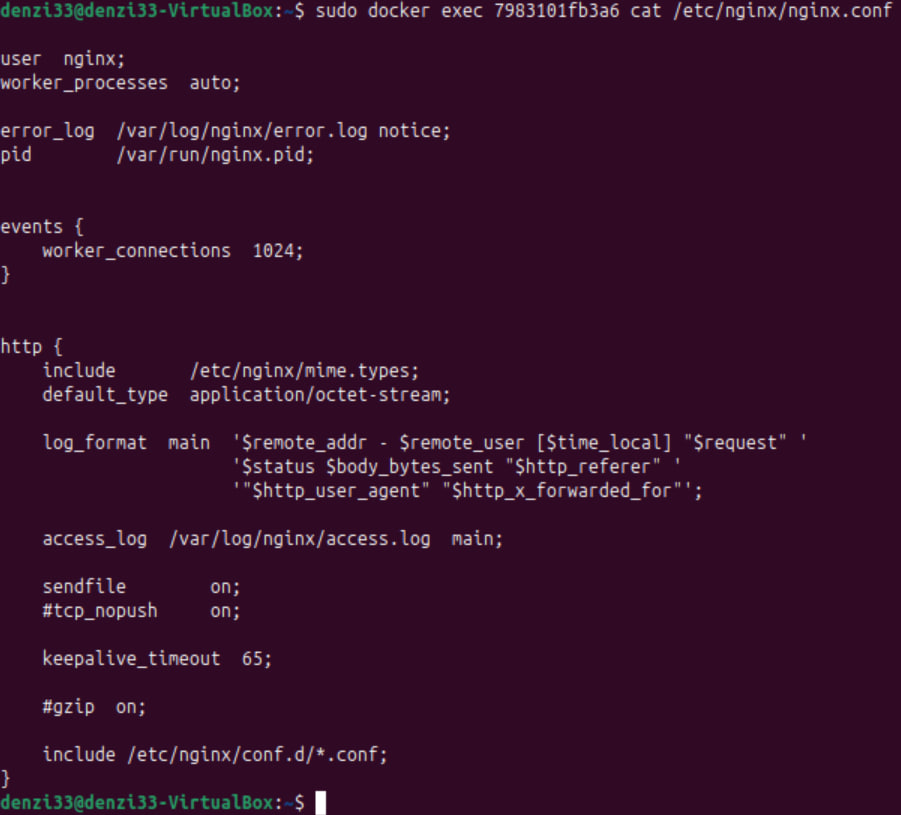

* Let's create a `nginx.conf` file on a local machine:
  * The created `nginx.conf` file:
  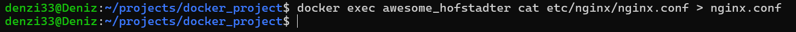

* Let's configure it on the `/status` path to return the `nginx` server status page:
  * The `nginx.conf` file:
  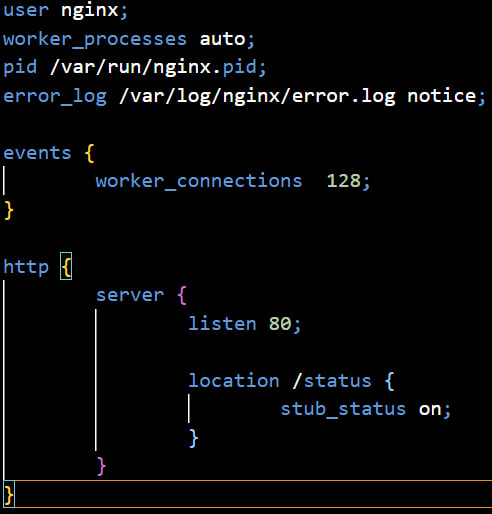

* Let's copy the created file inside the docker image:
  * `docker cp`:
  Copy files/folders between a container and the local filesystem.
  Usage: `docker container cp [OPTIONS] CONTAINER:SRC_PATH DEST_PATH|- docker cp [OPTIONS] SRC_PATH|- CONTAINER:DEST_PATH`.

  * The copying configuration file:
  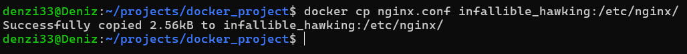

* Let's restart `nginx` inside the docker image:
  * The restarting `nginx`:
  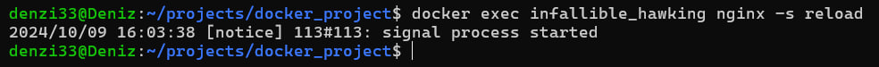

* Let's check that `localhost:80/status` returns server status page:
  * The checking `/status` route:
  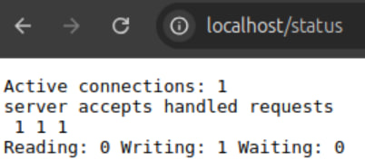

* Let's export the container to a `container.tar` file:
  * `docker export`:
  Export a container's filesystem as a tar archive.
  Usage: `docker container export [OPTIONS] CONTAINER`.

  * The exporting the container:
  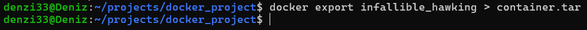

* Let's stop the container:
  * The stopping the container:
  

* Let's delete the image without removing the container first:
  * `docker image rm`:
  Remove one or more images.
  Usage: `docker image rm [OPTIONS] IMAGE [IMAGE...]`.
  Options: `-f` force removal of the image.

  * The removing the image:
  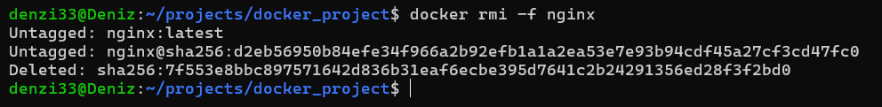

* Let's delete the stopped container:
  * `docker container rm`:
  Remove one or more containers.
  Usage: `docker container rm [OPTIONS] CONTAINER [CONTAINER...]`.

  * The deleting container:
  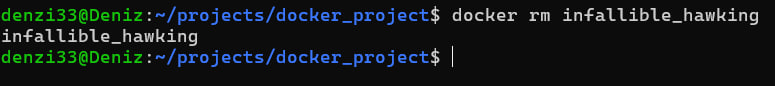

* Let's import the container back:
  * `docker import`:
  Import the contents from a tarball to create a filesystem image.
  Usage: `docker image import [OPTIONS] file|URL|- [REPOSITORY[:TAG]]`.
  Options: `-c` apply dockerfile instruction to the created image.

  * The importing container:
  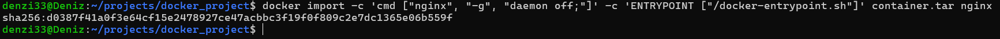

* Let's run the imported container:
  * The running the container:
  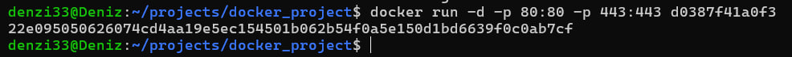

* Let's check that `localhost:80/status` returns the server status page:
  * The status page:
  

## Part 3. Mini web server

* Let's write a server in `C` and `FastCgi` that will return a simple page:
  * The mini server:
  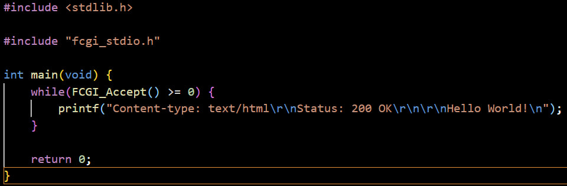

* Let's run the server on port `8080`:
  * The running mini server:
  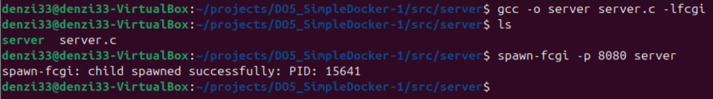

* Let's write `nginx.conf` file that will proxy all requests from port `81` to `127.0.0.1:8080`:
  * The writting `nginx.conf` file:
  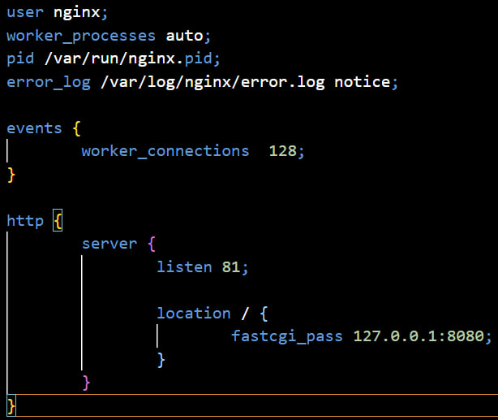

* Let's check that browser on `localhost:81` returns the page:
  * The checking browser:
  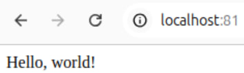

## Part 4. Your own docker

* Let's write docker image that:
  1) builds mini server sources on `FastCgi`
  2) runs it on port `8080`
  3) copies inside the image written `./nginx/nginx.conf`
  4) runs `nginx`

  * The building the docker file:
  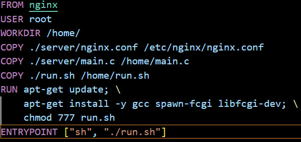

  * The script is:
  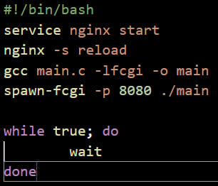

* Let's build the docker image:
  * `docker build`:
  Build an image from a `Dockerfile`.
  Usage: `docker image build [OPTIONS] PATH | URL | -`.
  Options: `-t` name and optionally a tag in the `name:tag` format.

  * The docker image:
  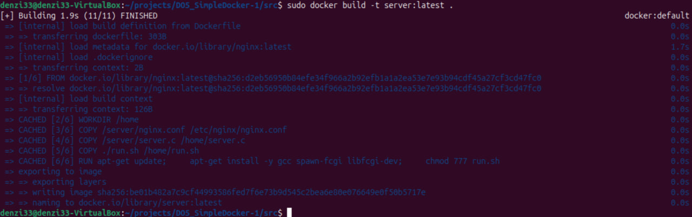

* Let's check that everything is built correctly:
  * The docker image:
  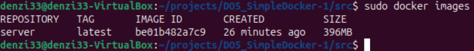

* Let's run the built docker image by mapping port `81` to `80` on the local machine and mapping the `./nginx` folder inside the container to the address where the `nginx` configuration files are located and check that the page is available on `localhost:80`:
  * Options: `-v` bind mount a volume.

  * The checking page:
  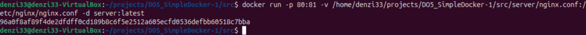

* Let's check that the server is available on `localhost:80`:
  * The checking page:
  

* Let's add proxying of `/status` page in `./nginx/nginx.conf` to return the `nginx` server status:
  * The adding page:
  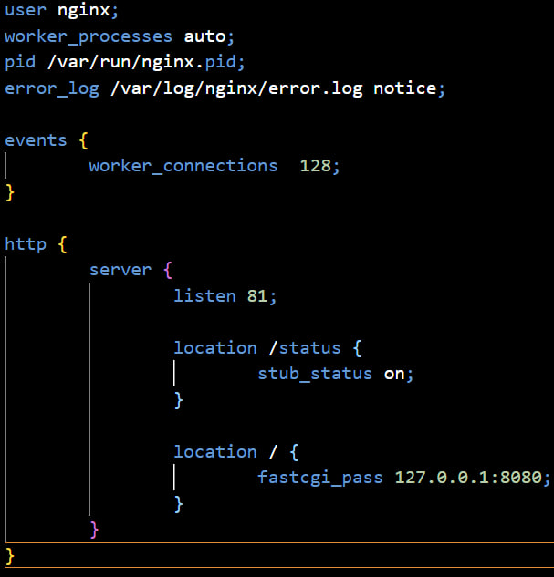

* Let's restart the docker image:
  * The restarting page:
  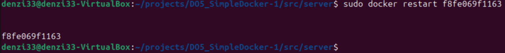

* Let's check that `localhost:80/status` returns `nginx` status:
  * The status page:
  

## Part 5. Dockle

* Let's check the image with dockle:
  * `dockle`:
  Usage: `dockle [image_id|repository]`.

  * The dockle checking:
  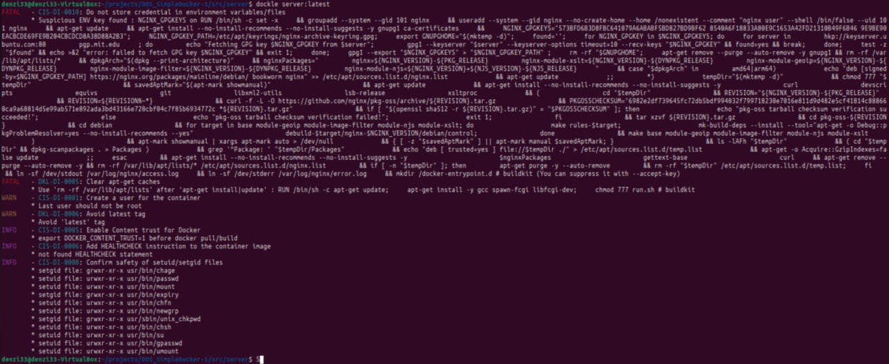

* Let's fix the image:
  * The fixed dockerfile:
  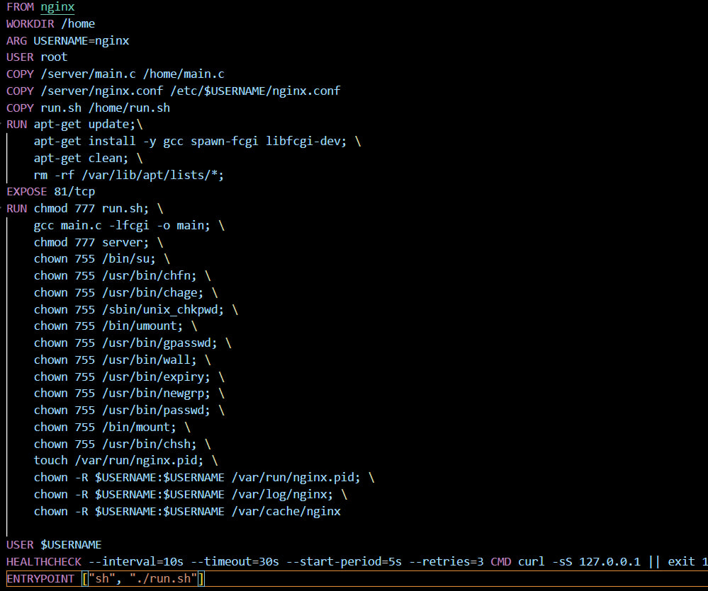

  * The second dockel checking:
  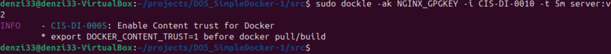

## Part 6. Basic Docker Compose

* Let's write a `docker-compose.yml` file:
  1) start the docker container
  2) start the docker container with `nginx` which will proxy all requests from port `8080` to port `81` of the first container
  3) map port `8080` of the second container to port `80` of the local machine

  * The `docker-compose.yml` is:
  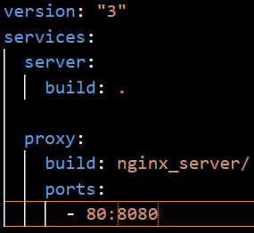

* Let's stop running containers:
  * The running containers:
  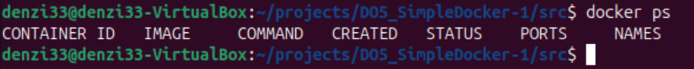

* Let's build and run the project:
  * `docker-compose build`:
  Build or rebuild services.
  Usage: `docker compose build [OPTIONS] [SERVICE...]`.

  * The project buildind:
  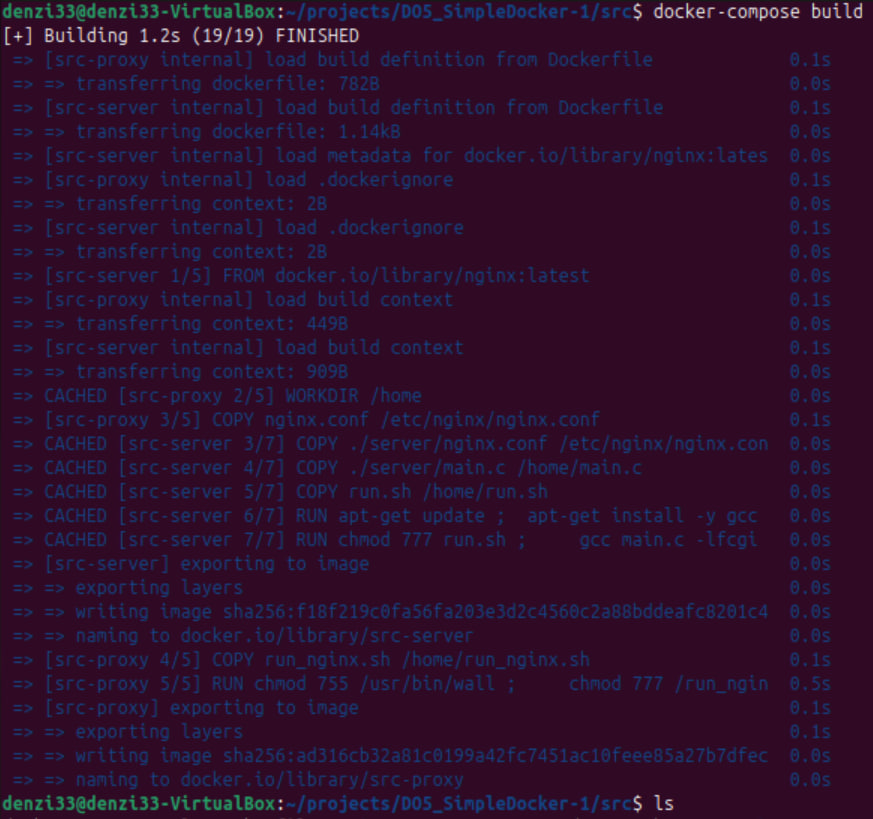

  * `docker-compose up -d`:
  Create and start containers.
  Usage: `docker compose up [OPTIONS] [SERVICE...]`.
  Options: `-d` run containers in the background.

  * The running project containers:
  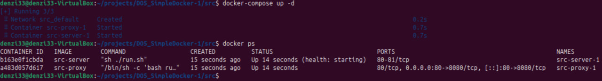

* Let's check the `localhost`:
  * The checking:
  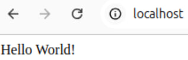
