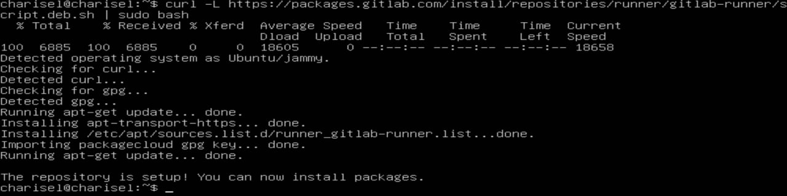
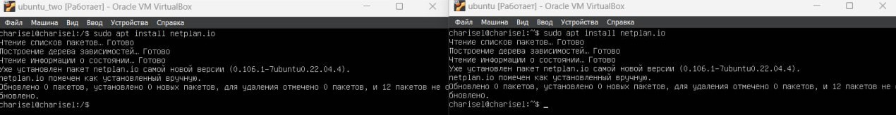

# Basic CI/CD

## Part 1. Setting up the gitlab-runner

* Let's start *Ubuntu server 22.04 LTS* virtual machine.
  * The started virtual machine:
  

* Let's download and install *gitlab-runner* on the virtual machine.
  * The result of the actions:
  
  
  

* Let's run *gitlab-runner* and register it for use in the current project.
  * The running *gitlab-runner*:
  

  * The registration *gitlab-runner*:
  

## Part 2. Building

* In the *gitlab-ci.yml* file, add a stage to start the building via *Makefile* from the *C2* project. Save post-build files to a random directory with a 30-day retention period.
  * The build stage is:
  

  * The build stage success:
  

## Part 3. Codestyle test

* If the codefile didn't pass, `"fail"` the pipeline. In the pipeline, display the output of the *clang-format* utility.
  * The codestyle stage is:
  

  * The clang-format logs are:
  

  * The codestyle stage success:
  

## Part 4. Integration tests

* Let's run this stage automatically only if the build and codestyle test passes successfully.
If tests didn't pass, `"fail"` the pipeline. In the pipeline, display the output of the succeeded / failed integration tests.
  * The test stage is:
  

  * The tests logs are:
  

  * The test stage success:
  

## Part 5. Deployment stage

* Let's launch the second virtual machine *Ubuntu Server 22.04 LTS*.
  * Two virtual machines:
  

* Let's configurate second adapter on all virtual machines.
  * The second adapter configuration:
  

* Let's install *netplan* on virtual machines.
  * The installation:
  

* Let's configurate virtual machines *netplan* files.
  * The netplans configuration:
  

* Let's check virtual machines connection.
  * The `ping` result:
  

* Let's write deploy stage.
  * The deploy stage is:
  

* Let's write deploy script.
  * The deploy script is:
  

* Let's generate *ssh-keys* on virtual machines.
  * The generation:
  

* Let's add the second machine *ssh-key* to *GitLab*.
  * The *ssh-key* on *GitLab*:
  

* Let's do next actions by `root` to prepare the *pipeline*.
  * Let's add `environment` in *gitlab-runner* `config.toml`:
  

  * Use `key-scan` to save a clone of second virtual machine on the first virtual machine:
  

  * Copy private *ssh-key* to the first virtual machine:
  

  * Use `ssh-copy-id` without `root` to copy key to the second virtual machine:
  

  * And restart the *gitlab-runner*:
  

* Let's make *commit* to check *pipeline*.
  * The *pipeline* work:
  

* Let's check the deploying result.
  * The deploying result:
  

## Part 6. Bonus. Notifications

* Let's set up notifications of *successful*/*unsuccessful* *pipeline* execution via bot named `charisel_DO6_CI/CD` in *Telegram*.
  * Write to *BotFather* `start`:
  

  * Get from *new_bot* and set it `name` and `username`:
  

  * Write to *Get My ID* bot `start`:
  

  * Let's launch *notify script* after every stage:
  

  * The *notify script* is:
  

  * The result is:
  
