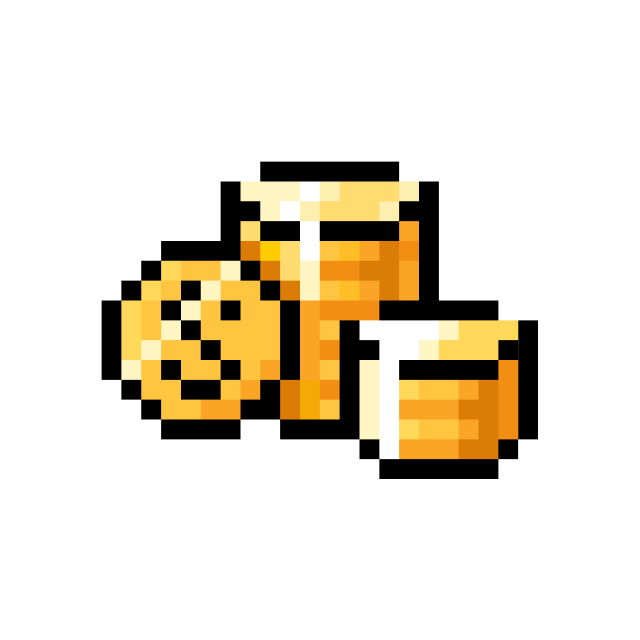

#

<!-- Logo -->

    

## Repository Description

This repository is a set of projects written by me during my studies at *School 21*.

## School 21 Description

**School 21** (The analogue of the *School 42*) — Free digital technology school. This is an innovative approach to learning programming. It offers free, non-profit education without traditional teachers, lessons, and grades. Instead, students learn through teamwork and project activities.

## Prject Program

- Name: *C-1*
- Projects: *SimpleBashUtils*, *s21_string+*, *s21_decimal*, *s21_matrix*, *C7_BrickGame_v1.0*, *C_Ex*.
- Description: Basic projects in the C programming language.

- Name: *DO-1*
- Projects: *D01_Linux*, *D02_Linux_Network*, *D04_SimpleDocker*, *D06_CICD*, *D0_Ex-t*.
- Description: Basic DevOps projects.

- Name: *SQL-1*
- Projects: *SQL-1*, *SQL_Ex*.
- Description: Basic SQL projects.

- Name: *CPP-1*
- Projects: *s21_matrix+*, *s21_containers*, *CPP3_BrickGame_v2.0*, *3DViewer_v2.0*, *CPP_Ex*.
- Description: Basic projects in the C++ programming language.

## Education Account Description

### General

- Nickname - *charisel*
- Campus - *Moscow*
- Program: *Core program*
- Wawe: 22.10
- Level: **11**
- E-mail: <charisel@student.21-school.ru>

### Points

- XP: **16160**

### Peer Feedback

- Nice: 4/4 😃
- Punctual: 4/4 ⏲
- Rigorous: 4/4 ⚖️
- Interested: 4/4 ❓

All Peer Reviews: 127

### Badges

#### Edu Progress

- Name: *Real programmer*
- Rank: 4/5.
- Description: Successfully perform 21 projects.

- Name: *Perfectionist*
- Rank: 3/5.
- Task: Successfully perform 10 project with a bonus part.

- Name: *Mistakes are not for me*
- Rank: 3/5.
- Task: Successfully perform 10 projects in a row without failur.

- Name: *Welcome on board*
- Rank: No rank.
- Task: The Survival Camp was completed.

- Name: *3 PRP*
- Rank: No rank.
- Task: No task.

#### Academic Activities

- Name: *Such a listener*
- Rank: 5/5.
- Task: Visit 50 lectures.

- Name: *Lead the World*
- Rank: 2/5.
- Task: Be a team lead in 5 projects.

#### Social Activities

- Name: *Happy Halloween!*
- Rank: No rank.
- Task: 🎃BOOOO!🎃.

- Name: *Computer Security Day*
- Rank: No rank.
- Task: Happy Cybersecurity Day!

- Name: *Harry New Year, Moscow!*
- Rank: No rank.
- Task: Happy New Year, our dear, beloved peers!

- Name: *Space Exploration Day*
- Rank: No rank.
- Task: As Yuri Gagarin once said: `Let's go!`

#### Other

- Name: *Billionaire*
- Rank: 3/5.
- Task: Accumulate 500 coins.

- Name: *Happy Halloween!*
- Rank: No rank.
- Task: Happy Halloween!

- Name: *Happy Birthday, Moscow сampus!*
- Rank: No rank.
- Task: The Moscow campus of School 21 has turned 5 years old!

- Name: *Happy birthday, Wave 16!*
- Rank: No rank.
- Task: With love from ADM :)

#### Supporting

- Name: *Will you be my peer?* ❤️
- Rank: No rank.
- Task: Love is School 21, which has become a second home!

### Skills

- C: **1423**
- Web: **136**
- C++: **1188**
- OOP: **1156**
- Linux: **558**
- Python: **946**
- DevOps: **264**
- Backend: **117**
- Graphics: **587**
- Team work: **925**
- DB & Data: **109**
- Shell/Bash: **319**
- Algorithms: **1881**
- Leadership: **1244**
- Parallel computing: **23**
- Company experience: **3574**
- Structuredprogramming: **1551**
- Types and data structures: **804**
- Network & System administration: **506**
