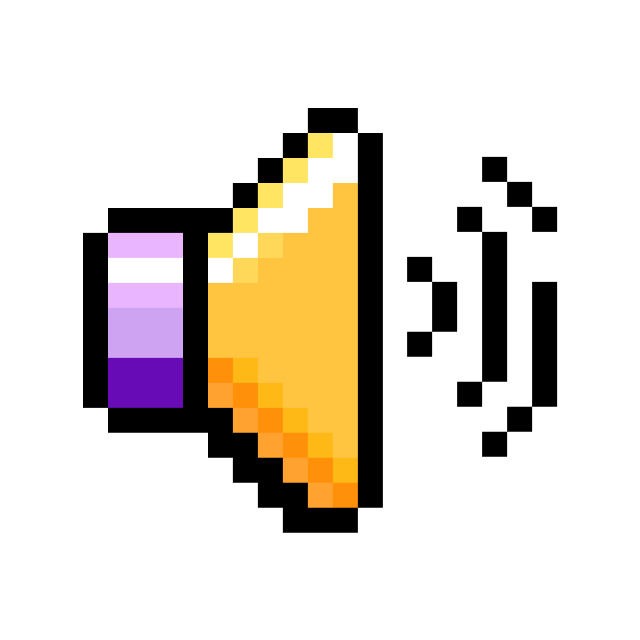

#

<!-- School 21 Logo -->

    

## Repository Description

This repository is a collection of projects written while studying at *School 2️⃣1️⃣*.

## School 21 Description

**School 2️⃣1️⃣** (the analogue of the *School 4️⃣2️⃣*) — free digital technology school. This is an innovative approach to learning programming. It offers free, non-profit education without traditional teachers, lessons, and grades. Instead, students learn through teamwork and project activities.

## Repository File Structure

- *content*: the material necessary for the design of the repository and it's elements.
- *project_clusters*: a set of projects where each project consists of small projects united by one common theme.
- *projects*: a set of projects where each project represents the final product.
- *.markdownlint.json*: the main configuration file *README.md* file.
- *README.md*: the description file of the current repository (you are reading it now).

## Education Account Description

### General

- Nickname: *charisel*.
- Campus: *Moscow*.
- Program: *Core program*.
- Wawe: 22.10.
- Level: **11**.
- E-mail: <charisel@student.21-school.ru>.

### Points

- XP: **16160**.

### Peer Feedback

- Nice: 4/4 😃
- Punctual: 4/4 ⏲
- Rigorous: 4/4 ⚖️
- Interested: 4/4 ❓

All peer reviews: 133.

### Badges

#### Edu Progress

- Name: *Real programmer*.
- Rank: 4/5.
- Description: successfully perform 21 projects.
<!-- Badge Photo -->

- Name: *Perfectionist*.
- Rank: 3/5.
- Task: successfully perform 10 project with a bonus part.
<!-- Badge Photo -->

- Name: *Mistakes are not for me*.
- Rank: 3/5.
- Task: successfully perform 10 projects in a row without failur.
<!-- Badge Photo -->

- Name: *Welcome on board*.
- Rank: no rank.
- Task: the *survival camp* was completed.
<!-- Badge Photo -->

- Name: *3 PRP*.
- Rank: no rank.
- Task: no task.
<!-- Badge Photo -->

#### Academic Activities

- Name: *Such a listener*.
- Rank: 5/5.
- Task: visit 50 lectures.
<!-- Badge Photo -->

- Name: *Lead the World*.
- Rank: 2/5.
- Task: be a team lead in 5 projects.
<!-- Badge Photo -->

#### Social Activities

- Name: *Happy Halloween!*
- Rank: no rank.
- Task: BOOOO!
<!-- Badge Photo -->

- Name: *Computer Security Day*.
- Rank: no rank.
- Task: *Happy Cybersecurity Day*!
<!-- Badge Photo -->

- Name: *Harry New Year, Moscow!*
- Rank: no rank.
- Task: *Happy New Year*, our dear, beloved peers!
<!-- Badge Photo -->

- Name: *Space Exploration Day*.
- Rank: no rank.
- Task: as *Yuri Gagarin* once said: `Let's go!`
<!-- Badge Photo -->

#### Other

- Name: *Billionaire*.
- Rank: 3/5.
- Task: accumulate 500 coins.
<!-- Badge Photo -->

- Name: *Happy Halloween!*
- Rank: no rank.
- Task: *Happy Halloween*!
<!-- Badge Photo -->

- Name: *Happy Birthday, Moscow сampus!*
- Rank: no rank.
- Task: the *Moscow* campus of *School 21* has turned 5 years old!
<!-- Badge Photo -->

- Name: *Happy birthday, Wave 16!*
- Rank: no rank.
- Task: with love from ADM.
<!-- Badge Photo -->

#### Supporting

- Name: *Will you be my peer?*
- Rank: no rank.
- Task: love is *School 21*, which has become a second home!
<!-- Badge Photo -->

### Skills

<!-- Skill Wheel Photo -->

- *C*: **1423**.
- *Web*: **136**.
- *C++*: **1188**.
- *OOP*: **1156**.
- *Linux*: **558**.
- *Python*: **946**.
- *DevOps*: **264**.
- Graphics: **587**.
- *Backend*: **117**.
- Team work: **925**.
- DB & Data: **109**.
- Algorithms: **1881**.
- Leadership: **1244**.
- *Shell* / *Bash*: **319**.
- Parallel computing: **23**.
- Company experience: **3574**.
- Types & data structures: **804**.
- *Structured programming*: **1551**.
- Network & System administration: **506**.
