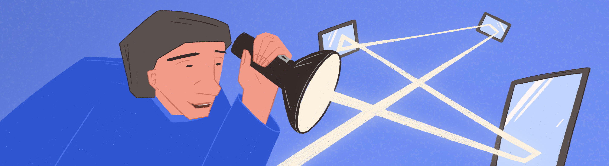

# 3DViewer v2.2

Implementation of 3DViewer v2.2

The russian version of the task can be found in the repository.

## Contents

1. [Chapter I](#chapter-i) \
   1.1. [Introduction](#introduction)
2. [Chapter II](#chapter-ii) \
   2.1. [Information](#information)
3. [Chapter III](#chapter-iii) \
   3.1. [Part 1](#part-1-3dviewer-v22) \
   3.2. [Part 2](#part-2-bonus-settings) \
   3.3. [Part 3](#part-3-bonus-optimization)

## Chapter I

*-- So, in today's episode, we continue our look at ray tracing. Last time we stopped at this notion of path tracing.*

*-- Yes, these two concepts are often mixed up. I think the easiest thing to remember is that path tracing is basically a special case of ray tracing, then all the confusion goes away.*

*-- So the path tracing should be a simpler operation than the ray tracing?*

*-- Yes, that's right. You see, after one ray bounces off an object, it can turn into 10 rays, and those 10 can turn into 100, 1000, and so on. So we get an exponential increase in the number of rays. It is possible to visualize one frame, but I dread to imagine how long it would take to calculate all these rays for several frames. For that reason, a less complicated version of ray tracing - path tracing - is used. The rays only produce a single ray per bounce and do not follow a set line, but rather shoot off in a random direction. So, for greater reliability of the resulting image in the tracing path, instead of sending out one ray it sends out tens, hundreds or even thousands of rays. And, yet, it is still faster than classical ray tracing.*\
*And even despite this acceleration, people still come up with various ways to speed up the algorithm even more: reduced rendering resolution when bouncing rays, limitations on the distance to which they can escape, and so on.*

*-- And what about the quality of the algorithms? Shouldn't ray tracing produce higher quality renders?*

*-- Of course. But unfortunately, we have limited computing power. This applies not only to gamers, but also to large animation and CGI studios. The majority still use different variations of path tracing to create their masterpieces. However, there are certain methods that can further improve the quality of renders obtained with path tracing and bring them closer to real ray tracing. For example, you can reflect rays not just randomly, but according to certain patterns.*

Buffering 15%... 35%.. 50%.. 77%...

## Introduction

In this project you’ll need to modify the application developed in the 3D Viewer v2.1 project. The new version should render a three-dimensional scene using ray tracing.

## Chapter II

## Information

### Historical background

Originally, computer graphics focused on imitating the visual characteristics of objects. This included the visibility and shading of object polygons by certain approaches to achieve a result similar to reality. However, with the introduction of ray tracing comes the idea of applying concepts and models that have a real physical meaning to computer graphics. They decided to try rendering images by taking into account the reflection and refraction of light coming from light sources. Yet developers Arthur Appel, Robert Goldstein and Roger Nagel, who first attempted rendering by ray tracing in the early 60s, and who were severely limited in resources and technology, came to the conclusion that it was not necessary to trace all rays coming from a light source. The only rays relevant to rendering are those that enter the observer's "eye". Given the laws of optics (e.g., the fact that the angle of incidence is equal to the angle of reflection) it is quite easy to show that if you trace the rays backwards, the result will be almost the same, but it will take significantly fewer resources. Hence, in 1963 at the University of Maryland the first image using ray tracing was obtained.

Later, more complex raytracing models began to appear, taking into account global illumination, indirect illumination from other objects, refraction, and more. Ray tracing is what has become a long-established algorithm for photorealistic images in computer graphics.

### Rendering with ray tracing

The ray-tracing algorithm, with its conceptual simplicity, involves a lot of calculations, the number of which depends on the accuracy degree in modelling the rays' travel through the scene. As already mentioned, backward ray tracing is used in practice, i.e. the rays come from the observer's eye, as in the case of ray casting. However, the difference between these two methods is quite significant, although some of the authors of study guides see the two methods as synonymous.

With backwards ray tracing, the rays emitted from the observer not only determine the visibility of the object, but also its visual characteristics. It is enough to mathematically describe the shape of a scene object and specify a number of coefficients, and so, if the ray behavior model is described in enough detail, the pixel color itself will be obtained, without the need for additional approaches to shading or calculating the color of the object.

Read more about rendering with ray tracing in the materials.

## Chapter III

## Part 1. 3DViewer v2.2

Modify 3DViewer v2.1.

- The program must be developed in C++ language of C++17
- The program code must be located in the src folder
- When writing code it is necessary to follow the Google style
- The program must be built with Makefile which contains standard set of targets for GNU-programs: all, install, uninstall, clean, dvi, dist, tests. Installation directory could be arbitrary, except the building one
- The program should be developed according to the principles of object-oriented programming; the structured programming approach is not allowed
- Prepare full coverage of modules related to model loading and affine transformations with unit-tests
- **Multiple models can be loaded and displayed** on the screen at a time
- The program must provide the ability to:
  - Load a model from an obj file (support for vertices, surfaces, normals lists and possibly uv-coordinates) and load an object from a standard pool of analytically described stereometric objects: sphere, cylinder, cone, cube, pyramid (use polygonal approximations for the viewer display and analytical description for rendering with ray tracing).
  - Translate the separate model and the whole scene by a given distance in relation to the X, Y, Z axes.
  - Rotate the separate model and the whole scene by a given angle in relation to the X, Y, Z axes. The scene should be rotated around the origin.
  - Scale the separate model and the whole scene by a given value.
  - Toggle the type of object display: wireframe model, flat shading, smooth shading (by Gouraud or Phong methods)
  - Set a directional light source with the corresponding characteristics (position, intensity and color via 3 RGB components), set the global illumination (intensity and color via 3 RGB components).
  - Render an image into a separate file in bmp, jpeg or png format by ray tracing with a user-specified resolution (up to 1920x1440) image by pressing the button; after rendering, the image should be displayed in a separate preview window in the GUI
  -  Enable or disable the display of the "floor" - the plane on which the model is placed by default
  - Add up to 5 additional models to the scene. Provide the ability to switch between models to apply affine transformations and change properties for each specific model
  - Set visual properties of the object: coefficient of transparency, refraction, reflection, surface roughness
- GUI implementation, based on any GUI library with API for C++ 
  * For Linux: GTK+, CEF, Qt, JUCE
  * For Mac: GTK+, CEF, Qt, JUCE, SFML, Nanogui, Nngui
- The graphical user interface must contain:
  - A button to select the model file and a field to output its name.
  - A scene visualization area.
  - Button/buttons and input fields for translating the model.
  - Button/buttons and input fields for rotating the model.
  - Button/buttons and input fields for scaling the model.
  - A button for rendering with ray tracing
  - A button to enable/disable the floor display
  - A button for adding a new model to the scene
  - Buttons for switching the selection of the current model to apply actions to it
  - Information about the uploaded model - file name, number of vertices and edges.
- The program must correctly processes and allows user to view models with details up to 100, 1000, 10,000, 100,000, 1,000,000  vertices without freezing (a freeze is an interface inactivity of more than 0.5 seconds)
- The program must be implemented using the MVC pattern, and also:
  - there should be no business code in the view code
  - there should be no interface code in the controller and the model
  - controllers must be thin
- There should be at least three different design patterns (e.g. facade, strategy and command)
- Classes must be implemented within the `s21` namespace
- To perform affine transformations, you can use the matrices from the library of the previous s21_matrix+ project

## Part 2. Bonus. Settings

- The program must allow customizing the type of projection (parallel and central)
- The program must allow setting up the type (solid, dashed), color and thickness of the edges, display method (none, circle, square), color and size of the vertices
- The program must allow choosing the background color
  -The program must allow selecting the base color of the object
- Settings must be saved between program restarts
- Provide the ability to add up to 5 new point light sources with the setting of their own parameters (position, intensity and color through three RGB components)

## Part 3. Bonus. Optimization

- Implement partitioning of the scene space using the KD-tree and optimize the search for intersections of rays with scene objects through a binary tree search 

💡 [Tap here](https://forms.yandex.ru/cloud/64181be484227c2507957cfe/) **to leave your feedback on the project**. Product Team really tries to make your educational experience better.
